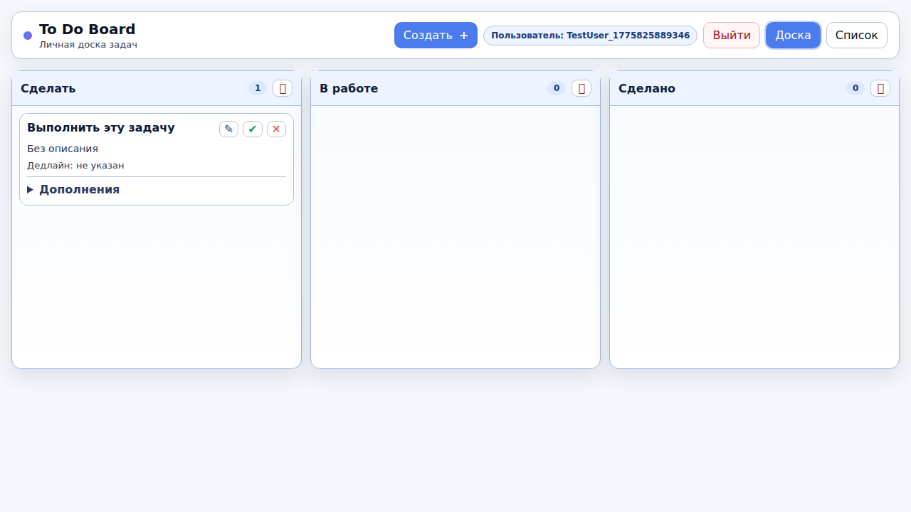
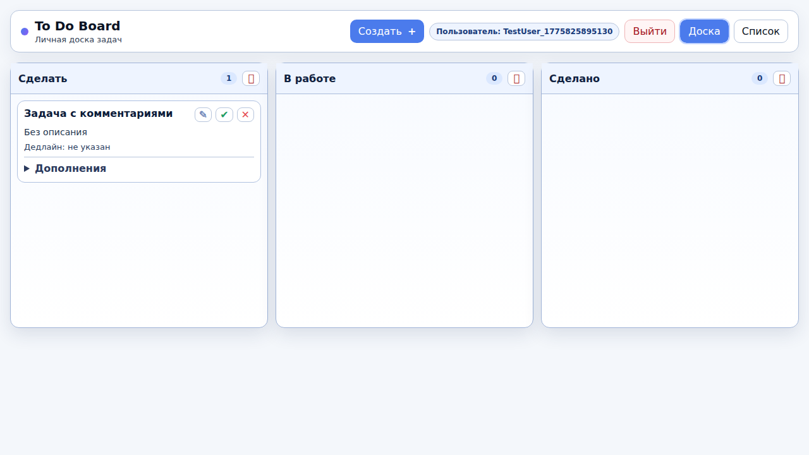

# Баг-репорты ToDoList

| ID | Заголовок | Описание | Предусловие | Шаги воспроизведения | Фактический результат | Ожидаемый результат | Скриншот |
|----|-----------|----------|-------------|----------------------|-----------------------|---------------------|----------|
| BUG-001 | Кнопка "галочка" не перемещает задачу в "Сделано" | Функция `markTaskDone()` не передаёт `title` на сервер, сервер возвращает ошибку 400. **Приоритет: Высокий** | Пользователь авторизован, есть задача в колонке "Сделать". [http://localhost:8001/](http://localhost:8001/) | 1. Создать задачу 2. Нажать кнопку "галочка" (✔) | Задача остаётся в "Сделать", в консоли ошибка 400. | Задача перемещается в "Сделано", счётчики обновляются. |  |
| BUG-002 | Кнопка "галочка" не блокируется у выполненной задачи | Следствие BUG-001: задача не попадает в "Сделано", поэтому кнопка не становится `disabled`. **Приоритет: Средний** | Пользователь авторизован, есть задача. [http://localhost:8001/](http://localhost:8001/) | 1. Создать задачу 2. Нажать "галочка" (✔) 3. Проверить состояние кнопки | Кнопка остаётся активной, задача не перемещена. | Задача в "Сделано", кнопка "галочка" неактивна (disabled). |  |
| BUG-003 | Автотесты не могут раскрыть блок "Комментарии" | Вложенные `
` в карточке — Playwright находит 2 элемента `
` вместо одного. Ручное тестирование работает. **Приоритет: Низкий (баг в тестах)** | Пользователь авторизован, есть задача. [http://localhost:8001/](http://localhost:8001/) | 1. Создать задачу 2. Раскрыть "Дополнения" > "Комментарии" 3. Добавить комментарий | Автотест падает с ошибкой strict mode violation. | Комментарий добавляется и отображается. |  |
